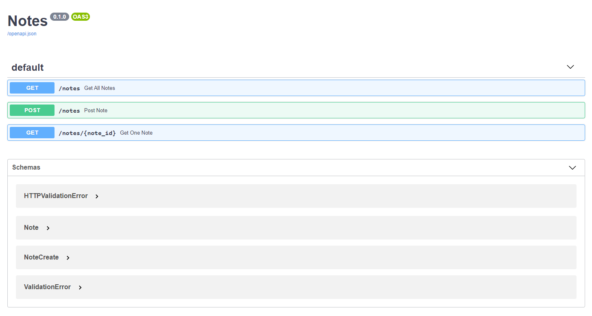
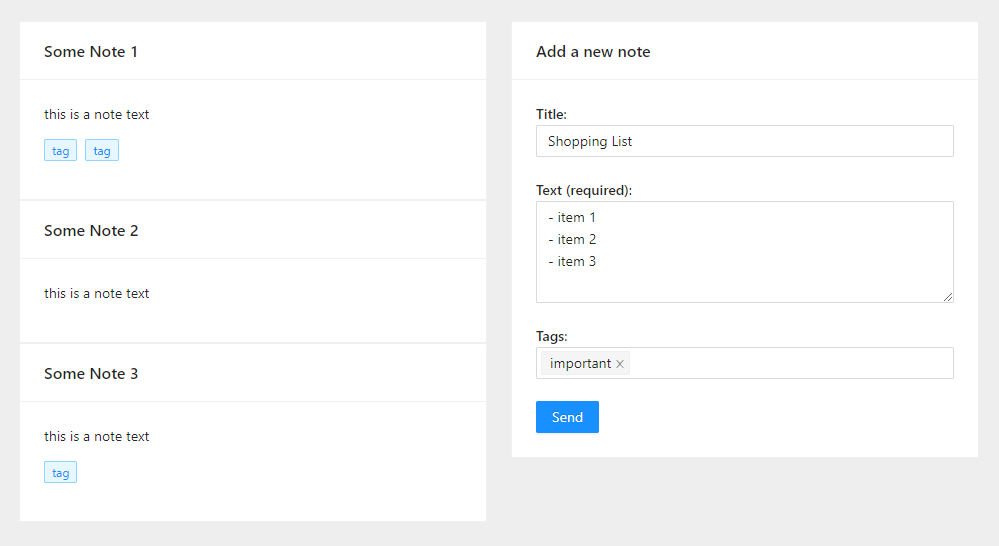

# FastAPI - How to connect Python backends with Javascript frontends

_This is the demo for the TechLabs Berlin workshop weekend WT2020._


## Structure

This repo consists of two main components:

### 1. Backend

The `/backend` is a FastAPI application written in Python.
It provides three simple REST-API endpoints that simulate a simple notes application backend.

### 2. Frontend

The `/frontend` is a React application written in JavaScript.
It provides exemplatory communication with the backend and displays the data provided by the API.

## Setup

### 1. Backend

For the backend you need to have Python 3.7 installed.  
Also, you need to install [pipenv](https://github.com/pypa/pipenv).

Enter the directory `/backend` and run the two commands:

```bash
pipenv install
pipenv run dev
```

This installs all dependencies in an virtual environment and runs the development server.

### 2. Frontend

For the frontend you need to have npm installed.

Enter the directory `/frontend` and run the following two commands:

```bash
npm install
npm start
```

This installs all dependecneis and runs the development page.

## Access

### 1. Backend

The backend is accessible via http://localhost:8000.  
Under http://localhost:8000/docs you can access the API specification.



### 2. Frontend

The frontend is accessible via http://localhost:3000.  
You can access the API via the frontend.


